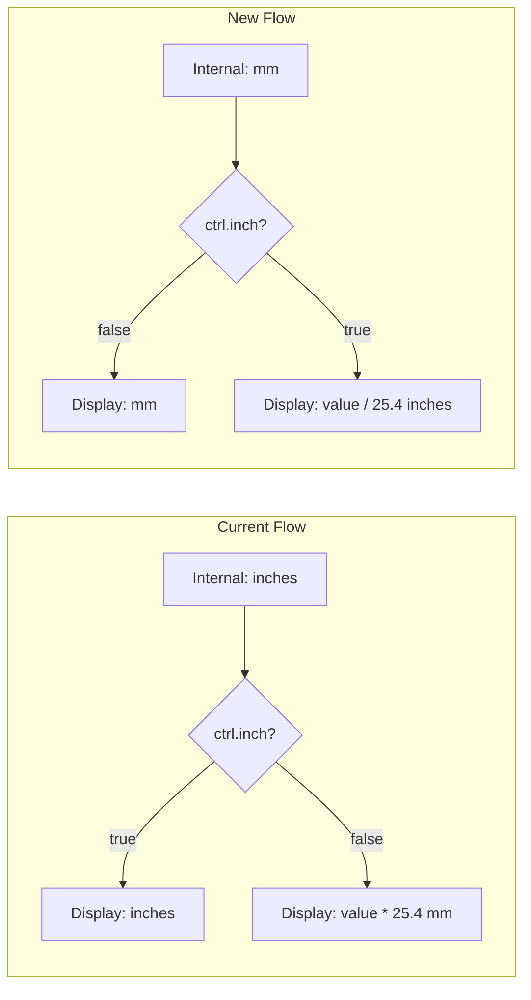

# Invert Unit System: Millimeters as Base Unit

**STATUS: COMPLETED**

## Overview

Convert the internal calculation unit from inches to millimeters, making mm the standard and inch an optional display format. All internal values, defaults, and calculations will use mm, with conversion to inches only for display when the user selects that option.

## Architecture Change



## Implementation Todos

- [x] Update bowlprop, ctrl, and view2d defaults in bowl.js to use mm values
- [x] Convert init() control point coordinates from inches to mm scale
- [x] Invert reduce() function in common.js to treat values as mm internally
- [x] Update unitChange() logic in bowl.js for mm-first approach
- [x] Change 0.5 inch offsets to 12.7mm in bowl_calculator.js
- [x] Update default ring height in ring_calculator.js to 19mm
- [x] Update slider min/max/step/value attributes in index.html for mm
- [x] Update JSDoc comments in types.js to reflect mm units
- [x] Update test files to use mm-based values

## Files to Modify

### 1. Update Default Values in [js/bowl.js](js/bowl.js)

Change `bowlprop` defaults from inches to mm:
- `thick: 0.25` → `thick: 6` (6mm)
- `pad: 0.125` → `pad: 3` (3mm)
- `rings[0].height: 0.5` → `rings[0].height: 19` (19mm)

Change `ctrl` defaults:
- `step: 1/16` → `step: 0.5` (0.5mm increments)
- `sawkerf: 0.125` → `sawkerf: 3` (3mm)

Change `view2d`:
- `canvasinches: 8` → rename to `canvasmm: 200` (approx 8 inches)

### 2. Update Initial Control Points in `init()` ([js/bowl.js](js/bowl.js))

Convert pixel-to-real coordinate multipliers from inches to mm:
```javascript
// Current (inches)
{ x: view2d.centerx + 1.0 * view2d.scale, ... }

// New (mm) - multiply by 25.4
{ x: view2d.centerx + 25.4 * view2d.scale, ... }
```

### 3. Invert the `reduce()` Function in [js/common.js](js/common.js)

Current logic converts inches → mm. Invert to convert mm → inches:
```javascript
// Current
if (ctrl.inch == false) {
    return (value * 25.4).toFixed(1).concat(' mm');
}

// New
if (ctrl.inch == true) {
    return formatAsFraction(value / 25.4, step);  // Convert mm to inches
}
return value.toFixed(1).concat(' mm');  // Already in mm
```

### 4. Update `unitChange()` in [js/bowl.js](js/bowl.js)

- Swap the rounding/conversion logic (internal values stay as mm)
- Update slider step attributes: `1/16` inch → `0.5` mm base
- Update zoom text to show mm by default

### 5. Update Coordinate Conversion Functions in [js/bowl_calculator.js](js/bowl_calculator.js)

The `-0.5` offset (half inch for bottom margin) needs to become `-12.7` (mm equivalent):
- `screenToRealPoint()`: change `-.5` → `-12.7`
- `realToScreen()`: change `ofst = -.5` → `ofst = -12.7`
- `screenToReal()`: change `-.5` → `-12.7`

### 6. Update Default Ring Height in [js/ring_calculator.js](js/ring_calculator.js)

In `calcRings()`, new rings default height:
- `height: .75` → `height: 19` (19mm)

### 7. Update HTML Slider Attributes in [index.html](index.html)

Wall thickness slider:
- `min="0" max="1" value=".25" step=".0625"` → `min="0" max="25" value="6" step="0.5"`

Ring tolerance slider:
- `min="0" max=".5" value=".125" step=".0625"` → `min="0" max="12" value="3" step="0.5"`

### 8. Update Type Definitions in [js/types.js](js/types.js)

Update JSDoc comments to reflect mm units instead of inches.

## Summary of Value Conversions

| Property | Current (inches) | New (mm) |
|----------|-----------------|----------|
| `bowlprop.thick` | 0.25 | 6 |
| `bowlprop.pad` | 0.125 | 3 |
| `rings[].height` | 0.5 / 0.75 | 19 |
| `ctrl.step` | 0.0625 (1/16") | 0.5 |
| `ctrl.sawkerf` | 0.125 | 3 |
| `view2d.canvasinches` | 8 | 200 (rename to `canvasmm`) |
| Bottom offset | 0.5 | 12.7 |
